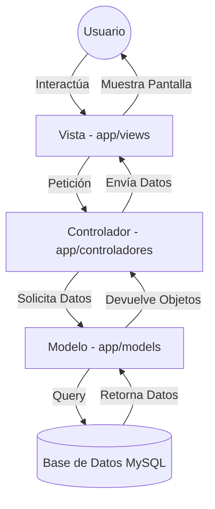
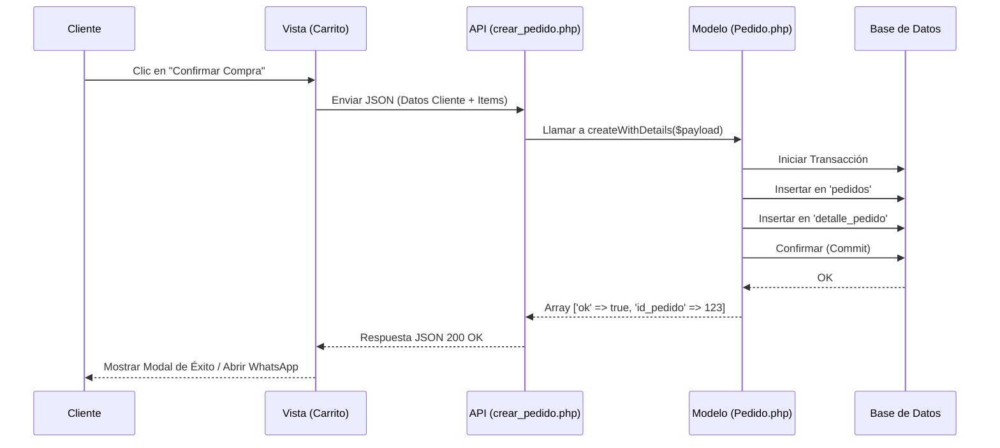

# 🍱 ViandaLibre - Sistema de Gestión de Viandas


## 📝 Descripción
ViandaLibre es una plataforma web integral diseñada para la venta y administración de viandas saludables. El sistema permite a los usuarios navegar por un catálogo dinámico, gestionar un carrito de compras y realizar pedidos vía WhatsApp, mientras que el administrador cuenta con un panel exclusivo para gestionar el inventario, las categorías y el estado de los pedidos.

## 🚀 Instalación

1. **Clonar el repositorio:**
   ```bash
   git clone https://github.com/usuario/viandas.git
   ```
2. **Configurar el Servidor Local:**
   - Mover la carpeta del proyecto a `C:\xampp\htdocs\viandas`.
   - Iniciar Apache y MySQL desde el XAMPP Control Panel.
3. **Importar la Base de Datos:**
   - Acceder a `phpMyAdmin`.
   - Crear una base de datos llamada `viandalibre_db`.
   - Importar el archivo `sql/schema.sql`.
4. **Configuración de Conexión:**
   - Revisar el archivo `config/db.php` para asegurar que las credenciales de MySQL sean correctas.
5. **Acceso:**
   - Usuario: `http://localhost/viandas/public/`
   - Admin: `http://localhost/viandas/public/login.php` (Credenciales: `admin` / `admin123`)

## 🛠️ Tecnologías Utilizadas
- **Backend:** PHP 7.4+ (Arquitectura MVC).
- **Frontend:** HTML5, CSS3, JavaScript (Vanilla).
- **Estilos:** Bootstrap 5 para un diseño responsivo y moderno.
- **Base de Datos:** MySQL con extensión MySQLi.

## 📂 Estructura de Directorios
| Carpeta | Descripción |
| :--- | :--- |
| `app/controllers` | Contiene la lógica de negocio y procesa las peticiones del usuario. |
| `app/models` | Gestiona la interacción con la base de datos (CRUD de Pedidos y Viandas). |
| `app/views` | Contiene las plantillas HTML/PHP (Vistas) que el usuario final visualiza. |
| `config/` | Archivos de configuración del sistema y conexión a DB. |
| `includes/` | Componentes reutilizables como el Header, Footer y funciones auxiliares. |
| `public/` | Punto de entrada del sistema. Contiene los activos estáticos (CSS, JS, Imágenes) y la API. |
| `public/api` | Endpoints JSON para operaciones asíncronas (AJAX). |
| `sql/` | Scripts de creación y población de la base de datos. |

## 👥 Autores
- **Grupo 10** - Desarrollo y Documentación.

-Santiago Militello
-Candela Borodij
-Damian Lombardo

## 🏗️ Arquitectura del Sistema (MVC)



## 🔄 Flujo de Compra (Diagrama de Secuencia)



## 📊 Diccionario de Datos: Tabla `pedidos`

| Columna | Tipo | Nulo | Relación / Descripción |
| :--- | :--- | :--- | :--- |
| `id_pedido` | INT | NO | **PK** - Identificador único autoincremental. |
| `fecha_pedido` | TIMESTAMP | NO | Fecha y hora del registro (Default: CURRENT_TIMESTAMP). |
| `cliente_nombre` | VARCHAR(100) | NO | Nombre completo del comprador. |
| `cliente_whatsapp` | VARCHAR(20) | NO | Número de contacto para coordinación de entrega. |
| `direccion_entrega` | VARCHAR(255) | NO | Domicilio donde se enviará el pedido. |
| `total_pago` | DECIMAL(10,2) | NO | Monto total acumulado del pedido. |
| `estado` | ENUM | NO | Estado actual: 'Pendiente', 'En Cocina', 'Enviado', 'Entregado'. |

---

## 📘 Manual Técnico (Documentación de Endpoints)

### `GET /api/get_viandas.php`
- **Descripción:** Obtiene todas las viandas disponibles para el catálogo.
- **Respuesta (JSON):**
```json
[
  {
    "id_vianda": 1,
    "nombre": "Milanesa con Puré",
    "precio": "4500.00",
    "imagen_url": "milanesa_pure.png",
    "id_categoria": 1
  }
]
```

### `POST /api/save_pedidos.php`
- **Descripción:** Registra un nuevo pedido y sus detalles.
- **Cuerpo (JSON):**
```json
{
  "cliente_nombre": "Juan Perez",
  "cliente_whatsapp": "1122334455",
  "direccion_entrega": "Calle Falsa 123",
  "items": [
    {"id_vianda": 1, "cantidad": 2}
  ]
}
```
- **Respuesta (JSON):** `{"ok": true, "id_pedido": 45, "total_pago": 9000.00}`

---

## 📖 Manual de Usuario
1. **Navegación:** El usuario ingresa a la home y puede filtrar viandas por categoría.
2. **Selección:** Agrega productos al carrito usando el botón "+".
3. **Carrito:** Al finalizar, presiona el icono del carrito para revisar su pedido.
4. **Checkout:** Completa sus datos personales y confirma.
5. **WhatsApp:** El sistema genera un mensaje automático para enviar al vendedor.
